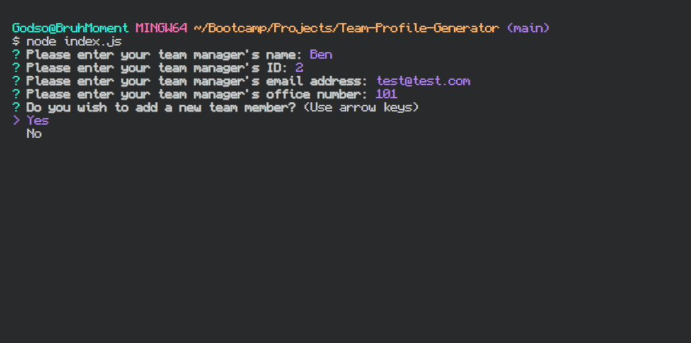

# Team Profile Generator

## Description
Its a command line program that generates an html file based on user inputs

## Table of Contents

- [Installation](#installation)
- [Usage](#usage)
- [Credits](#credits)
- [License](#license)
- [Contributing](#contributing)
- [Testing](#testing)
- [Questions](#questions)

## Installation

use npm i to install dependencies

## Usage

Open the directory with index.js and run node index.js to get the prompts started. Answer all the prompts to get a generated HTML with your team profile.

link.link/video.mp4

Here is a link to the live site: N/A

<!-- Here is a slot to put in screenshots -->
Here's a screenshot:

## Credits 

Credits: Inquirer, Jest

## License

This application is covered under the MIT license. Feel free to read more in the license file.

## Contributing

Please make a pull request

## Testing

npm run test 

## Questions

If you have any questions here's my [GitHub profile](https://github.com/FruityOkapi) and feel free to email me the questions directly at josephbsimmerman@gmail.com